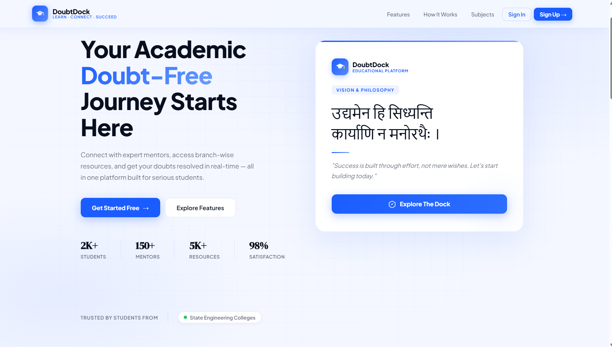
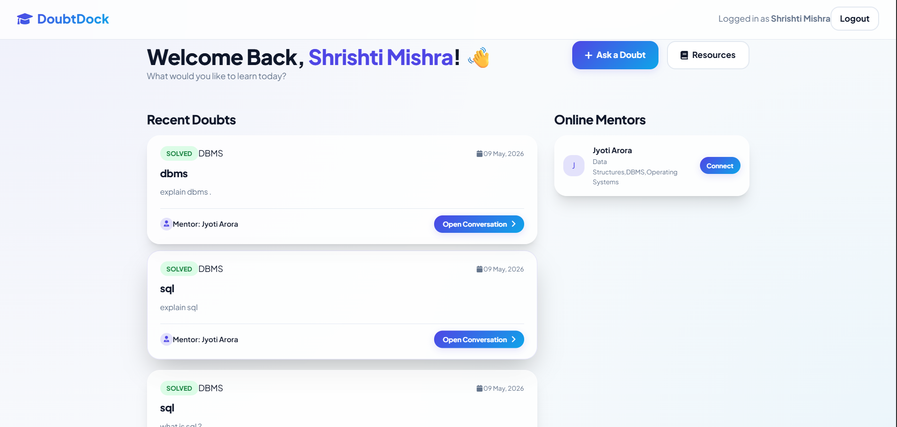
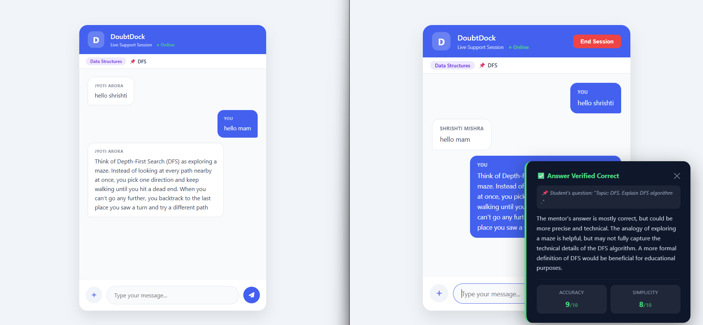
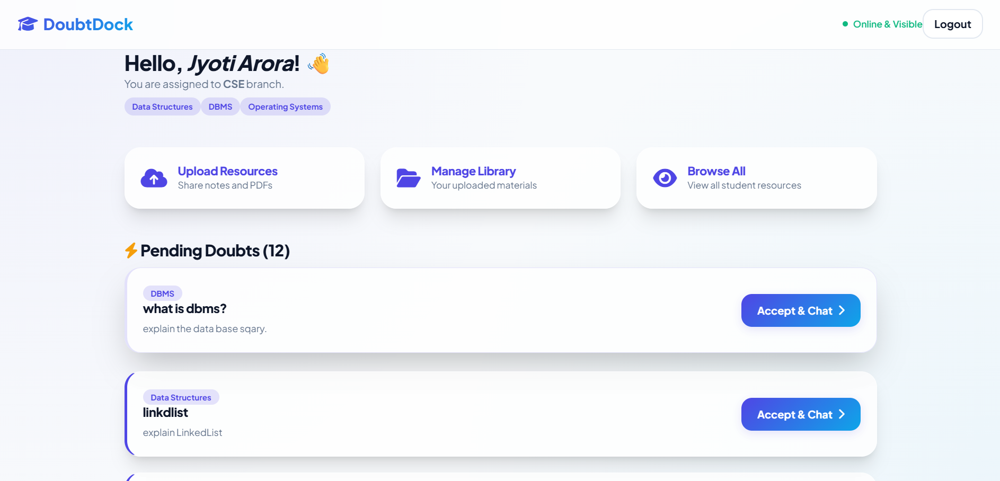
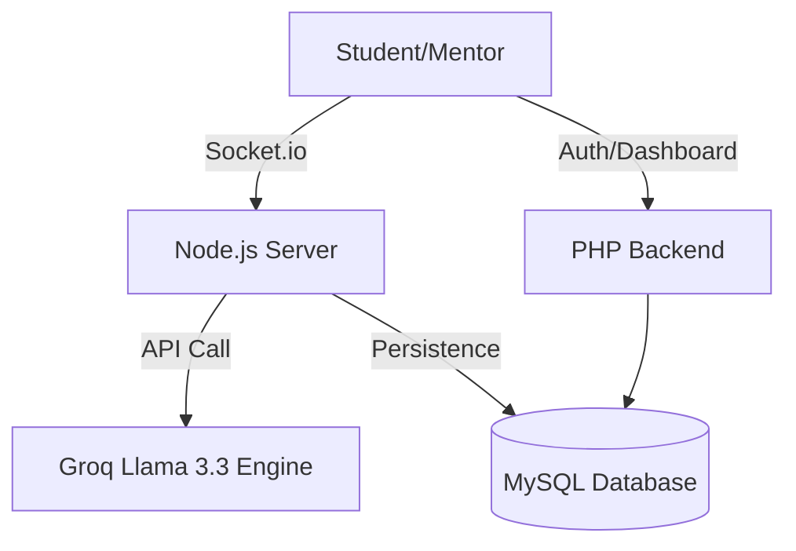

# 🚀 DoubtDock: AI-Powered Real-Time Doubt Solving Platform

[](https://www.php.net/)
[](https://nodejs.org/)
[](https://socket.io/)
[](https://groq.com/)

**DoubtDock** is a next-generation educational platform that bridges the gap between students and mentors. Built with a focus on real-time interaction and quality assurance, it features an industry-first **AI-verification engine** that ensures every educational response is accurate, simple, and effective.

---

## 🌟 Core Features

### 🧠 Smart AI Verification
*   **Real-Time QA:** Every mentor response is analyzed by the Llama-3.3 engine.
*   **Mentor Shielding:** If an answer is incorrect or too complex, the AI provides a corrected/simplified version live to the student.
*   **Performance Metrics:** Automatic scoring for **Accuracy** and **Simplicity** (0-10) for every educational interaction.

### ⚡ Real-Time Experience
*   **WhatsApp-Style Chat:** Bidirectional typing indicators (Header & Inline).
*   **Live Status:** Visual "Online/Offline" indicators for real-time presence.
*   **Zero Latency:** Powered by Socket.io for a seamless chatting experience.

### 🎓 Academic Management
*   **Resource Hub:** Categorized PDFs, Notes, and Blueprints by Branch (CSE, ME, ECE, etc.).
*   **Mentor Matching:** Students can connect with active mentors instantly.
*   **Session Management:** Secure ending of sessions with rating and feedback integration.

---

## 📸 Screenshots & Walkthrough

### 🏠 Landing Page
*Premium Glassmorphism UI with modern CTA sections.*


### 👤 Student Dashboard
*Intuitive dashboard to track doubts, connect with mentors, and access resources.*


### 💬 Real-Time AI Chat
*Clean chat interface showing AI verification pop-up and typing indicators.*


### 👨‍🏫 Mentor Dashboard
*Centralized hub for mentors to accept doubts and manage resource uploads.*


---

## 🛠️ Technical Architecture



---

## 🚀 Setup & Installation

### 1. Environment Setup
*   Clone the repository to your XAMPP `htdocs` folder.
*   Ensure **Node.js** and **PHP 8.x** are installed.

### 2. Database Initialization
*   Create a database `doubtdock` in phpMyAdmin.
*   Import the provided `schema.sql`.

### 3. Server Configuration
*   **PHP:** Edit `config.php` with your DB credentials and `NODE_URL`.
*   **Node.js:** Navigate to `chat_server/Server`, run `npm install`, and create a `.env` file:
    ```env
    GROQ_API_KEY=your_groq_api_key_here
    ```

### 4. Running the App
1. Start Apache & MySQL from XAMPP.
2. Start the Socket.io server: `node server.js`.
3. Visit `http://localhost/doubtdock_project/index.html`.

---

## 👨‍💻 Developer
**Jyoti Arora**  
*Computer Science Engineering*  
*Specializing in Full-Stack AI Integration*

---
© 2026 DoubtDock. All rights reserved.
